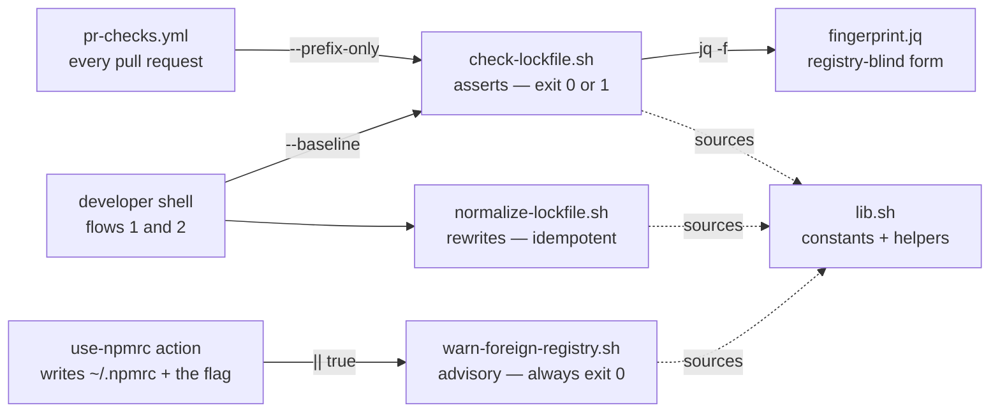
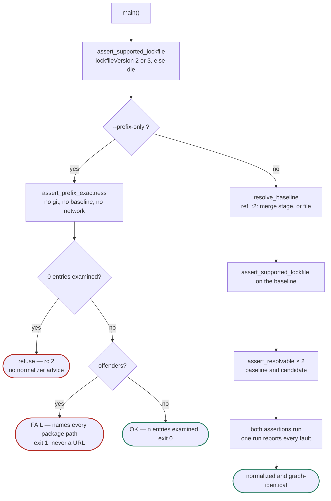
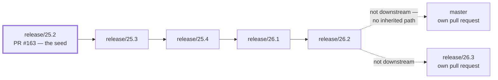

# Lockfile registry invariant — a visual overview of PFM-ISSUE-34453

Companion to [`research.md`](./research.md), [`design.md`](./design.md), [`plan.md`](./plan.md) and
[`review.md`](./review.md). Those record *how the work was decided*; this one explains *how the result works*, for a
reader meeting the toolchain for the first time.

> **The invariant.** Every non-root entry's `resolved` URL consists of exactly one registry prefix —
> `https://cplace.jfrog.io/artifactory/api/npm/cplace-npm/` — followed by that package's tarball path. Nothing else in
> the file may move when the prefixes are rewritten.

An HTML edition of this document, with hand-drawn diagrams, sits beside it as
[`overview.html`](./overview.html).

---

## 1. The fix

A lockfile entry that resolves via `registry.npmjs.org` is not fetched from where it says. npm's default
`replace-registry-host=npmjs` rewrites the host onto whatever registry `~/.npmrc` configures — and pacote builds the
new URL by joining the *old pathname* onto the new base, so the registry's own path prefix is discarded. The request
404s, and because that prefix is the `JFROG_URL` secret, CI prints the whole thing as `***`. That is why **every
message these scripts print names a package path and never a URL.**

The fix has two parts, attacking the same rewrite from opposite ends:

| | What it does | Where |
| --- | --- | --- |
| **The fix** — permanent | Rewrite every `resolved` prefix onto the proxy, so the lockfile already agrees with the registry and there is nothing to rewrite | `normalize-lockfile.sh`, guarded by `check-lockfile.sh` |
| **The mitigation** — interim | `replace-registry-host=never` switches the rewrite off entirely, rescuing lockfiles nobody has normalized yet — including every consumer's | [`use-npmrc/action.yml:25`](../../.github/actions/use-npmrc/action.yml) |

```mermaid
flowchart TB
  subgraph L1["1 · unfixed, default npm"]
    A1["entry on npmjs<br/>registry.npmjs.org/foo/-/foo-1.0.0.tgz"]
    A2["host rewritten<br/>new URL(oldPathname, registry)"]
    A3["GET cplace.jfrog.io/foo/-/foo-1.0.0.tgz<br/>no /artifactory/api/npm/cplace-npm"]
    A4(["404 — masked as *** in CI"])
    A1 -->|"replace-registry-host = npmjs"| A2
    A2 -->|"proxy path prefix dropped"| A3
    A3 --> A4
  end

  subgraph L2["2 · mitigation applied"]
    B1["entry still on npmjs<br/>nobody has normalized this lockfile"]
    B2["no rewrite at all<br/>each resolved URL fetched as written"]
    B3["GET registry.npmjs.org/foo/-/foo-1.0.0.tgz"]
    B4(["200 — but it bypassed the proxy:<br/>no Xray, no curation"])
    B1 -->|"use-npmrc:25 appends<br/>replace-registry-host=never"| B2
    B2 --> B3
    B3 --> B4
  end

  subgraph L3["3 · lockfile normalized"]
    C1["entry on the proxy<br/>cplace.jfrog.io/…/cplace-npm/foo/-/foo-1.0.0.tgz"]
    C2["nothing to rewrite<br/>true with the flag and without it"]
    C3["GET cplace.jfrog.io/artifactory/api/npm/cplace-npm/foo/-/foo-1.0.0.tgz"]
    C4(["200 — through the proxy, policy applied"])
    C1 -->|"host already matches —<br/>the flag is a no-op here"| C2
    C2 --> C3
    C3 --> C4
  end

  classDef bad stroke:#b3261e,stroke-width:2px;
  classDef ok stroke:#1f7a5a,stroke-width:2px;
  class A2,A3,A4 bad;
  class C2,C3,C4 ok;
```



Lane 2 removes the rewrite; lane 3 removes the *need* for it. Because the flag is a no-op on a normalized lockfile,
the two compose in either order and the flag can be dropped **per branch** rather than in a coordinated switchover —
once the advisory stops reporting anywhere.

The mitigation is not free, and lane 2 is why: an entry still on npmjs is fetched *from* npmjs, bypassing whatever
curation the proxy enforces. A deliberate, documented trade, owned by PFM-ISSUE-34454.

---

## 2. What the pull request contains

19 files, +5596/−173 against `release/25.2`. Four separable things — and the lockfile is committed **on its own**, so
its parent is the baseline the check verifies it against.

| Part | Files | What it is |
| --- | --- | --- |
| The toolchain | `tools/scripts/lockfile/` (10) | Normalizer, check, advisory, shared `lib.sh`, `fingerprint.jq`, three bats suites and their fixtures, plus the README runbook |
| The guard | `.github/workflows/pr-checks.yml` | The repository's first `on: pull_request` workflow — everything else is `workflow_call`-only. Two jobs: the invariant, and shellcheck + bats |
| The mitigation | `.github/actions/use-npmrc/action.yml` | `replace-registry-host=never`, plus the advisory step that inventories which consumer lockfiles still need normalizing |
| The lockfile | `package-lock.json` | 342 changed lines, +4788 bytes, 171 npmjs URLs → 0. Not one changed line outside a `"resolved"` |
| The record | `specs/2026-08-10_…` (5) | Research, design, plan, the consumer survey across 41 repositories, and the review with all 15 findings resolved |

`.prettierignore` gains `package-lock.json`: prettier would otherwise reformat the file the invariant is asserted
over, and every branch would drift on the first save.

---

## 3. The pieces

Bash and jq, in a repository that is otherwise TypeScript — deliberately. `npx ts-node` needs `node_modules`, which
needs `npm ci`, which is exactly what is broken when the lockfile carries npmjs URLs. A TypeScript normalizer could
not repair the lockfile it exists to repair.



`lib.sh` is sourced, never executed. It holds the proxy constant, both regexes and the one shared jq predicate —
defined once so the normalizer, the guard and the advisory cannot drift apart. They already had: three hand-written
copies of that predicate disagreed, and one of them passed an entry the guard rejected.

---

## 4. What a `resolved` URL is made of

Both assertions read the same string and cut it in the same place.

```
https://cplace.jfrog.io/artifactory/api/npm/cplace-npm/   @scope/pkg/-/pkg-1.2.3.tgz
└──────────────────────┬───────────────────────────────┘  └────────────┬────────────┘
          registry prefix                                    tarball path
   Assertion 2 — strip the path, require                Assertion 1 — keep only this,
   what remains to equal the constant                   compare the whole document
```

| | Assertion 1 — graph invariance | Assertion 2 — prefix exactness |
| --- | --- | --- |
| Asks | Did anything but the registry change? | Does every entry sit on the one proxy? |
| Catches | Changed version, poisoned `integrity`, renamed tarball, moved dependency edge, added or dropped entry | Entry on npmjs, typo'd `cplace-nmp`, stray path segment, `http://` downgrade, uppercase `HTTPS://` |
| Blind to | *Which host* an entry sits on | Everything except the host |
| Runs in | `--baseline` only | Both modes — it is the whole of the PR guard |

Neither subsumes the other, which is why both exist and why `check-lockfile.bats` asserts that each drift class fails
via the *correct* one.

---

## 5. The two modes

Getting this distinction wrong blocks every dependency update — and it did, in review. Graph invariance forbids *any*
change to the dependency graph: exactly right when proving a normalization commit touched nothing but prefixes,
exactly wrong on an everyday pull request where adding a dependency is the point.



`assert_resolvable` sits on the baseline path only. It is a precondition for *fingerprinting* — not for prefix
exactness — and in front of `--prefix-only` it hard-failed on exactly the npm-workspace and `link:` entries that mode
exists to allow.

---

## 6. Where it runs

### The pull-request guard

```yaml
- name: Check package-lock.json resolved URLs
  run: ./tools/scripts/lockfile/check-lockfile.sh --prefix-only
```

No `setup-node`, no `npm ci`, no baseline to fetch — the guard has to be trustworthy precisely when the lockfile is
broken. A second job runs `shellcheck` and the bats suites.

### Flow 1 — normalizing a branch

```bash
./tools/scripts/lockfile/normalize-lockfile.sh
git add package-lock.json
git commit -m 'PFM-ISSUE-34453 - github-actions: normalize package-lock.json resolved URLs onto the JFrog npm proxy'
./tools/scripts/lockfile/check-lockfile.sh --baseline HEAD~1
```

Commit the lockfile **on its own**. Then the commit's parent *is* the baseline and verification needs no ref to
remember. Expect 342 changed lines, +4788 bytes, and not one changed line outside a `"resolved"`.

### Flow 2 — resolving an upmerge conflict

```bash
git checkout --ours -- package-lock.json     # keep this branch's lockfile
./tools/scripts/lockfile/normalize-lockfile.sh
./tools/scripts/lockfile/check-lockfile.sh --baseline :2:   # :2: = ours, :3: = theirs
```

Proceed **only** on exit 0. Never `--theirs`, never a hand edit: the point is that correctness does not depend on
anyone reading a 262 KB diff.

### The advisory, on every consumer's runner

[`use-npmrc/action.yml:27`](../../.github/actions/use-npmrc/action.yml) runs the advisory against the *consumer's*
lockfile, through seven reusable workflows across roughly 41 repositories:

```yaml
run: bash "$GITHUB_ACTION_PATH/../../../tools/scripts/lockfile/warn-foreign-registry.sh" || true
```

The `|| true` is not belt-and-braces: the script's own "every precondition is a silent success" contract cannot cover
*not being reachable* — a missing exec bit, a path with spaces — and `continue-on-error` is not honoured on composite
steps. **The warnings are the inventory that decides when `replace-registry-host=never` can be removed.**

---

## 7. Reading a failure

| What you see | What it means | What to do |
| --- | --- | --- |
| `the dependency graph differs from the baseline` | Something other than a registry prefix changed — the bad-merge case | Do **not** re-run the normalizer; it rewrites prefixes and would not touch this. Work out why that entry moved |
| `every 'resolved' must carry exactly the … proxy prefix` | An entry is on npmjs, or on a typo'd proxy path | Run `normalize-lockfile.sh` |
| `… differ from the proxy ONLY in scheme: they use plain http` | Right host, wrong scheme | Run the normalizer — it rewrites onto `https` |
| `no usable tarball URL` | A non-root entry has no `resolved`, or resolves over `link:`/`file:`/`git+ssh:` | A deliberate, reviewed loosening of `assert_resolvable` — not a workaround. Fires on the baseline path and in the normalizer, never in the PR guard |
| `has no registry entries to check` | Zero entries examined; reporting compliance from an empty set is the vacuous pass this refuses to give | Expected only for an all-workspace lockfile, which needs a reviewed loosening too |
| `n entries in package-lock.json do not resolve via the … proxy` | The advisory, on a consumer runner. Never fails a build | Normalize that lockfile. When no pipeline reports this any more, the mitigation comes out |

---

## 8. The bats suite

74 cases across three files — 42 for the check, 19 for the normalizer, 13 for the advisory. They run on every pull
request beside `shellcheck`, and neither job may install an npm devDependency: that would mutate `package-lock.json`
on all seven branches and break the invariant under test.

```bash
bats tools/scripts/lockfile/
shellcheck tools/scripts/lockfile/*.sh tools/scripts/lockfile/test-helper.bash
```

Fixtures are tiny hand-written lockfiles from `test-helper.bash` — not copies of the real 262 KB file: the tests
assert behaviour, never byte counts.

### The six drift cases

`t1`–`t6` are the measured evidence behind the two-assertion design. Each injects a single fault and asserts not
merely that the check fails, but that it fails **via the right assertion** — without that, the two could silently
collapse into one.

| Case | Injected fault | Must fail via |
| --- | --- | --- |
| `t1` | Changed tarball filename | Graph invariance |
| `t2` | Typo'd proxy repo name — `cplace-nmp` | Prefix exactness |
| `t3` | Changed dependency edge | Graph invariance |
| `t4` | An entry left on npmjs | Prefix exactness |
| `t5` | Poisoned `integrity` hash | Graph invariance |
| `t6` | Poisoned `version` | Graph invariance |

### What else the suite pins

**Fails closed.** When `fingerprint_of` cannot run, the normalizer leaves the lockfile *untouched* and exits non-zero
— the case that once passed by comparing two empty outputs. A lockfileVersion 1 file, one with no `lockfileVersion` at
all, and a baseline predating the v2/v3 upgrade each fail with their own message rather than a jq trace.

**Contracts, not just outcomes.** No failure message contains the JFrog host, asserted directly, because CI masks it
as `***`. The advisory and the guard agree on what an offender is — they once disagreed, and the advisory
under-reported. The advisory exits 0 on a missing file, missing `jq`, invalid JSON, no `packages` section, and an
unreachable `lib.sh`. Everything `RESOLVED_URL_RE` accepts is capturable by `TARBALL_PATH_RE`; widening one without
the other deletes `resolved` keys instead of raising.

Two cases exist because a canary caught what the suite had not: a tarball path containing slashes —
`…/-/@scope/pkg-1.2.3.tgz`, which JFrog really serves — was reported as foreign while sitting on the proxy, and the
root entry could lose its `resolved` key silently. Both are pinned now, in a suite that had passed 65/65 the moment
before.

---

## 9. Seven branches, byte-identical

The same toolchain has to exist on every long-lived branch, and it has to be **the same bytes** on each. Not for
tidiness: an upmerge that finds an identical file on both sides resolves as a conflict-free add/add. One stray
character and every future upmerge stops on `tools/scripts/lockfile/` — the directory whose whole purpose is to make
upmerges mechanical.



`master` and `release/26.3` are not downstream of `26.2`, so no amount of upmerging carries the fix to them — each
needs its own pull request. That is why the rollout is seven PRs and not one plus a wait.

### How the rule is kept

The digest is the gate: hash these 13 files on each branch and require one value.

```
tools/scripts/lockfile/*  ·  .github/workflows/pr-checks.yml
.github/actions/use-npmrc/action.yml  ·  .prettierignore
```

It is recomputed after every change to the toolchain, and the six downstream branches are **rebuilt from the seed
rather than patched** — the tooling is copied verbatim, then the normalizer runs and the lockfile is committed alone,
then `check-lockfile.sh --baseline HEAD~1` proves the second commit moved nothing but prefixes.

The consequence worth internalising: **a fix to any of these files is seven commits, not one.** Three times during
review the toolchain changed and all six staged branches were discarded and rebuilt. That is cheap while the branches
are held back and expensive once they are pushed — which is why they are held back until the seed is approved.

| Branch | Entries | Lockfile commit | Route |
| --- | --- | --- | --- |
| `release/25.2` | 542 | 342 lines · +4788 B | PR #163 — the seed |
| `release/25.3` | 542 | 342 lines · +4788 B | own PR, then upmerge |
| `release/25.4` | 542 | 342 lines · +4788 B | own PR, then upmerge |
| `release/26.1` | 558 | 342 lines · +4788 B | own PR, then upmerge |
| `release/26.2` | 558 | 342 lines · +4788 B | own PR, then upmerge |
| `release/26.3` | 558 | 342 lines · +4788 B | own PR — off-chain |
| `master` | 558 | 342 lines · +4788 B | own PR — off-chain |

Identical line and byte counts across branches with different entry counts is not a coincidence to gloss over: the
171 npmjs entries are the same 171 packages everywhere, so the same rewrite applies. It is also a cheap tripwire — a
branch reporting different numbers has something else going on.

---

## 10. Source map

| File | Role |
| --- | --- |
| [`lib.sh`](../../tools/scripts/lockfile/lib.sh) | Shared constants and helpers. Sourced, never executed |
| [`check-lockfile.sh`](../../tools/scripts/lockfile/check-lockfile.sh) | The invariant check. Both assertions, both modes |
| [`normalize-lockfile.sh`](../../tools/scripts/lockfile/normalize-lockfile.sh) | The normalizer. Idempotent, and fails closed on its own fingerprint self-check before writing |
| [`warn-foreign-registry.sh`](../../tools/scripts/lockfile/warn-foreign-registry.sh) | Advisory. Emits a `::warning` plus a job summary; every exit is 0 |
| [`fingerprint.jq`](../../tools/scripts/lockfile/fingerprint.jq) | Reduces a lockfile to its registry-independent comparable form |
| [`use-npmrc/action.yml`](../../.github/actions/use-npmrc/action.yml) | Writes `~/.npmrc`, appends the mitigation, runs the advisory |
| [`pr-checks.yml`](../../.github/workflows/pr-checks.yml) | The guard job and the shellcheck/bats job |
| [`README.md`](../../tools/scripts/lockfile/README.md) | The runbook these sections condense |

Two properties to keep in mind when changing any of this. The proxy URL is a hard-coded constant **on purpose** — it
*is* the invariant being asserted, and a caller-supplied prefix would validate itself. And these files are meant to be
byte-identical across all seven long-lived branches, so change them on one and the change has to reach the others.
